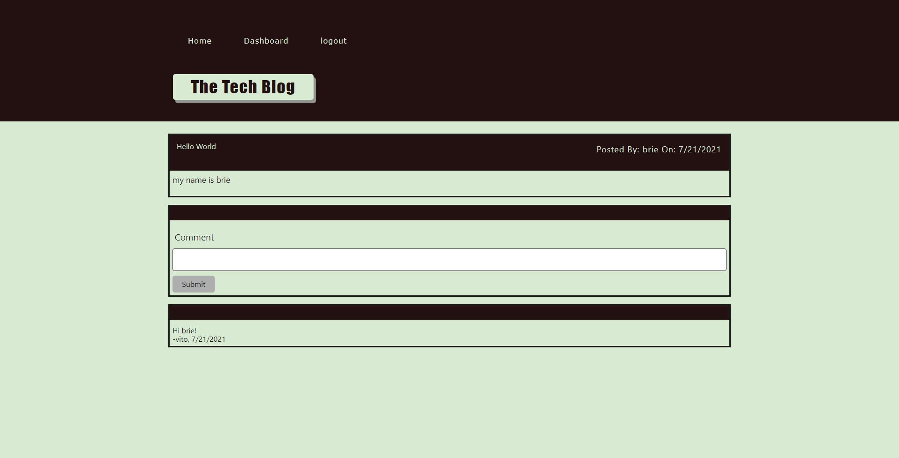
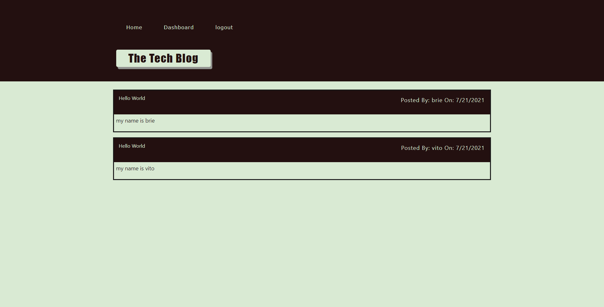

# Mvc-tech-blog
# E-Commerce Database

[](https://spdx.org/licenses/MIT.html)
 ## Table of Contents
1. [Description](#description)

2. [Installation](#installation)

3. [Usage](#usage)

4. [Contributions](#contributions)

5. [Questions](#questions)

-----

## Description
This application utilizes MySQL, NodeJS, ExpressJS, and the principals of Model-View-Controllers to bring the user a full stack experience. When the user first arrives on the landing page they will have to signup in order to gain access to the rest of the site. From there the user can create, update, delete, and view their posts as well as comment on posts by others! This application is an introduction to the power of using Model View Controllers to build powerful fullstack web applications

 -----

 ## Installation
 

   Getting Started:
   * check node is installed
   * npm installed
   * npm initialized
   * npm init
   * package.json and dependencies
  
    node -v
    npm install
    npm init --yes
    npm i express
    npm i mysql2
    npm i sequelize


  


 ## Usage

 ---

 Run MySQL Shell:
 
      cd db
      mysql -u root -p
      *enter password*
      quit
      cd ..

Seed the Database:
```
    npm run seed

```

   Start the Server:    
```
   node server.js
   OR
   nodemon server.js
```


Gif of Application:
--


Screenshot of Database in MYSQL Workbench:
--




Techology Used:
--
HTML5
CSS3
Javascript
MySql
Sequelize Npm

Visit the Repo: 
[Github]**<https://github.com/bdurham227/Mvc-tech-blog>**

   


 ## License
 
[](https://spdx.org/licenses/MIT.html)

   https://opensource.org/licenses/MIT

    Licensed under the MIT License

    Copyright © [2021] [Benjamin Durham]
    

         Permission is hereby granted, free of charge, to any person obtaining a copy of this software and associated documentation files (the "Software"), to deal in the Software without restriction, including without limitation the rights to use, copy, modify, merge, publish, distribute, sublicense, and/or sell copies of the Software, and to permit persons to whom the Software is furnished to do so, subject to the following conditions:
        
        The above copyright notice and this permission notice shall be included in all copies or substantial portions of the Software.
        
        THE SOFTWARE IS PROVIDED "AS IS", WITHOUT WARRANTY OF ANY KIND, EXPRESS OR IMPLIED, INCLUDING BUT NOT LIMITED TO THE WARRANTIES OF MERCHANTABILITY, FITNESS FOR A PARTICULAR PURPOSE AND NONINFRINGEMENT. IN NO EVENT SHALL THE AUTHORS OR COPYRIGHT HOLDERS BE LIABLE FOR ANY CLAIM, DAMAGES OR OTHER LIABILITY, WHETHER IN AN ACTION OF CONTRACT, TORT OR OTHERWISE, ARISING FROM, OUT OF OR IN CONNECTION WITH THE SOFTWARE OR THE USE OR OTHER DEALINGS IN THE SOFTWARE

## Contribution
---


 ## Questions
 ---
 For additional questions about usage, installation or application improvement contact me through

Github: https://github.com/bdurham227
GitHub Repo: https://github.com/bdurham227/Mvc-tech-blog
Heroku: https://durham-techblog.herokuapp.com/login

Email: bdurham227@gmail.com:

